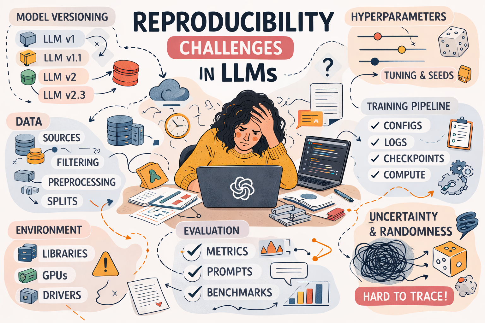

<!DOCTYPE html>
<html>
<head>

</head>
<body>

  

This reproducibility package was prepared for the paper titled "Reproducibility of LLM-based Recommender Systems Research:
Worrying Observations from an Initial Analysis" and submitted  to the ACM UMAP 2026.  For the uploaded picture, the credit goes to ChatGPT.

</body>
</html>  

